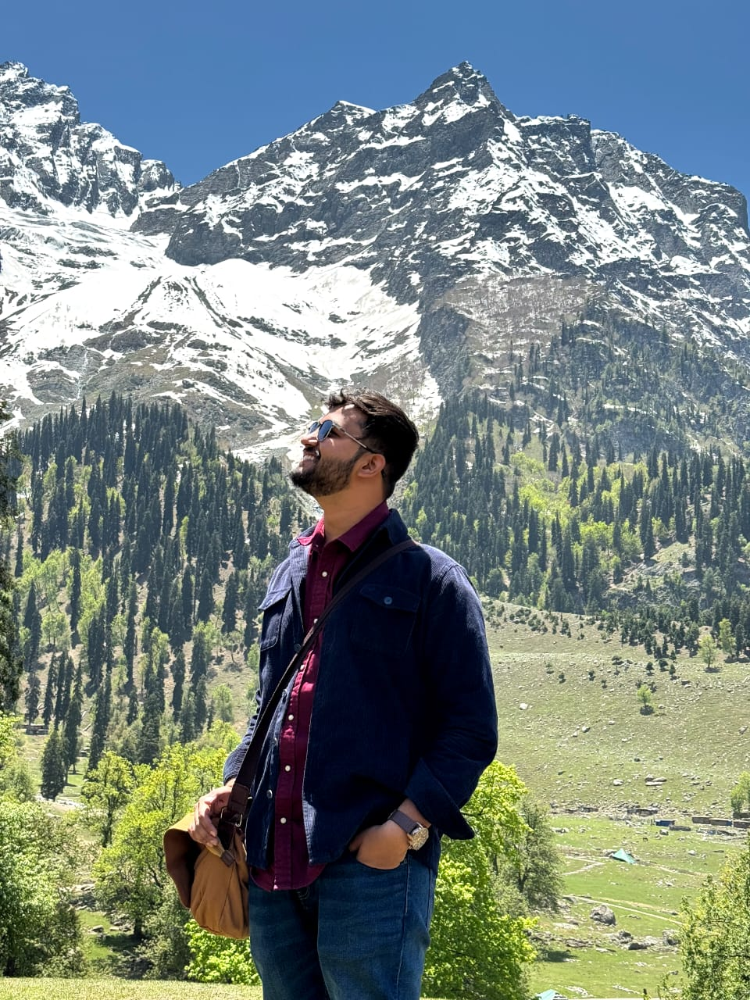

---
# the default layout is 'page'
icon: fas fa-info-circle
order: 4
---
I am Raghav Shrimali, currently working as Assistant project engineer in [HPCL-Rajasthan Refinery Limited](https://www.hrrl.in/) an Oil and gas public sector undertaking.

I have recently completed my master's from [IIT Kharagpur](https://www.iitkgp.ac.in/), and did my bachelor's in chemical engineering from [Panjab University](https://puchd.ac.in/) (2018-2022).

I have co-author a review paper "Strategies for rational design and applications of transition metal clusters". Topic of my master's thesis project was "molecular dynamics simulation of solvated transition metal clusters".

In my free time, I like to play Counter Strike and love to travel and trek beautiful terrains. 

{: w="700" h="400" }

> Add Markdown syntax content to file `_tabs/about.md`{: .filepath } and it will show up on this page.
{: .prompt-tip }
